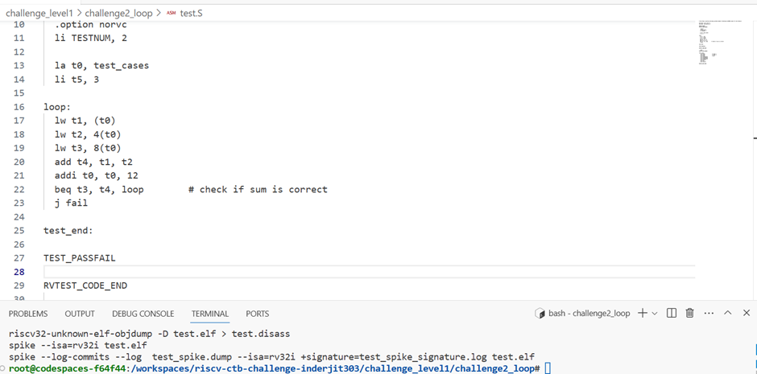

# riscv_ctb_challenges

# Challenge_level1_loop details: 

## Bug detected 
The issue lies in the beq instruction used to check if the sum is correct. The beq instruction compares t3 and t4, and if they are equal, it continues with the loop label, which increments t0 and processes the next set of test cases. 
But, when the sum is correct, the code should jump to the test_end label and pass the test, instead of continuing with the next loop iteration.

To fix the bug, the beq instruction should be replaced with a conditional branch to the test_end label when the sum is correct. We can use the bne (branch if not equal) instruction to achieve this as shown below: 
